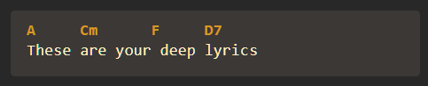
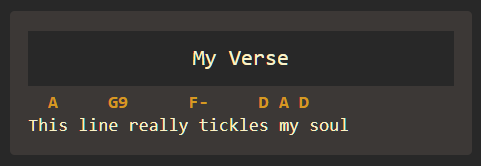
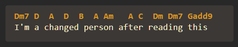
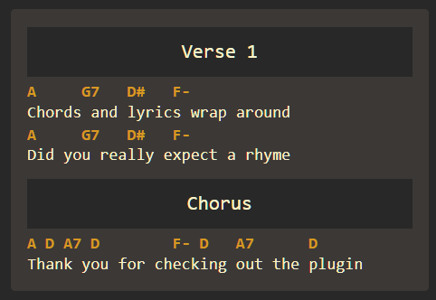
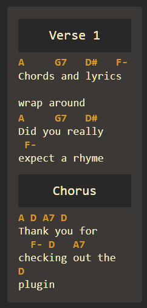

# Obsidian Chord Lyrics
This  plugin adds the ability to **display chords over lyrics** to [Obsidian](https://obsidian.md).

## Features
- Highlight chords
- Basic line wrapping on smaller screens while maintaining chord / lyrics relationship
- Automatically detects most chord / lyrics lines
- Ability to display a section header (e.g. *chorus* or *verse*)
- Customizable colors

## Examples
These small examples help you to quickly get going.

### Chords
To add chords just write them above the lyrics in a `chordlyrics` block.

~~~
```chordlyrics
A     Cm      F     D7
These are your deep lyrics
```
~~~

turns into



### Headers
To add a section header just add the name in between square brackets.

~~~
```chordlyrics
[My Verse]
  A     G9      F-     D A D
This line really tickles my soul
```
~~~

turns into



### Mark Lines
In case automatic detection leaves you hanging, you can mark chord lines with `%c` and text lines with `%t` at the end.

~~~
```chordlyrics
Dm7 D  A  D  B  A Am   A C  Dm Dm7 Gadd9 %c
I'm a changed person after reading this %t
```
~~~

turns into



### Wrapping
Chords and lyrics wrap around with less space while maintaining their relationship.

~~~
```chordlyrics
[Verse 1]
A     G7   D#   F-
Chords and lyrics wrap around
A     G7   D#   F-
Did you really expect a rhyme

[Chorus]
A D A7 D        F- D   A7      D
Thank you for checking out the plugin
```
~~~

turns into



with less available space everything wraps around


